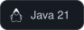
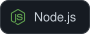
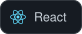
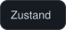
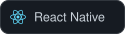
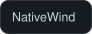
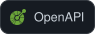

<h1 align="center">Iván</h1>

  

  <a href="https://www.linkedin.com/in/TU-USUARIO/"><!-- CAMBIAR -->
    
  </a>
  
  <a href="https://tu-portfolio.vercel.app"><!-- CAMBIAR -->
    
  </a>
  

  

##  Sobre mí

 Actualmente haciendo una **pasantía en Modica Seguros** (Argentina), desarrollando el backend con **Java 21 + Spring Boot**.

 Construyo aplicaciones de punta a punta: **API REST, panel web y app móvil**.

 Aprendiendo arquitectura de software, testing y buenas prácticas de seguridad.

 Hablo **español, inglés e italiano**.

 Escribime a **ivanecr07@gmail.com**

<b>English</b>

 

 Currently interning at **Modica Seguros** (Argentina), building the backend with **Java 21 + Spring Boot**.

 I build end-to-end applications: **REST APIs, web dashboards and mobile apps**.

 Learning software architecture, testing and security best practices.

 I speak **Spanish, English and Italian**.

 Reach me at **ivanecr07@gmail.com**

<b>Italiano</b>

 

 Attualmente in tirocinio presso **Modica Seguros** (Argentina), sviluppo il backend con **Java 21 + Spring Boot**.

 Realizzo applicazioni end-to-end: **API REST, pannelli web e app mobile**.

 Sto imparando architettura del software, testing e buone pratiche di sicurezza.

 Parlo **spagnolo, inglese e italiano**.

 Scrivimi a **ivanecr07@gmail.com**

##  Tech Stack

| Área | Tecnologías |
|:--|:--|
| **Lenguajes** |     |
| **Backend** |         |
| **Frontend** |      |
| **Mobile** |    |
| **Bases de datos** |    |
| **Herramientas** |       |

##  Proyectos

###  [aplicacion-gym](https://github.com/IvanCab07/aplicacion-gym)

Plataforma completa para la gestión de un gimnasio: API REST, app móvil para socios y staff, y panel web para el dueño.

`Java 21` · `Spring Boot 3` · `PostgreSQL + PostGIS` · `Flyway` · `JWT` · `Expo` · `React Native` · `NativeWind` · `React` · `Vite` · `Tailwind` · `OpenAPI → openapi-typescript`

###  [Proyecto](https://github.com/IvanCab07/Proyecto)

Aplicación full-stack con backend propio, cliente web y app móvil, tipada de punta a punta.

`Node.js` · `Express` · `TypeScript` · `Prisma (MySQL)` · `JWT` · `Vite` · `React` · `Tailwind` · `React Native (Expo SDK 54)` · `Zustand` · `TanStack Query`

###  Modica Seguros — Pasantía · *repositorio privado*

Backend de gestión para una aseguradora argentina: autenticación y autorización por roles, migraciones versionadas de base de datos y capa de persistencia con JPA.

`Java 21` · `Spring Boot 4` · `Spring Security` · `Spring Data JPA` · `MySQL` · `Flyway` · `JJWT` · `Lombok` · `Maven`

##  Estadísticas

  
  

  

  

##  Contribuciones

  <picture>
    <source media="(prefers-color-scheme: dark)" srcset="https://raw.githubusercontent.com/IvanCab07/IvanCab07/output/github-snake-dark.svg" />
    <source media="(prefers-color-scheme: light)" srcset="https://raw.githubusercontent.com/IvanCab07/IvanCab07/output/github-snake.svg" />
    
  </picture>

  <i>Gracias por pasar · Thanks for visiting · Grazie per la visita</i>

